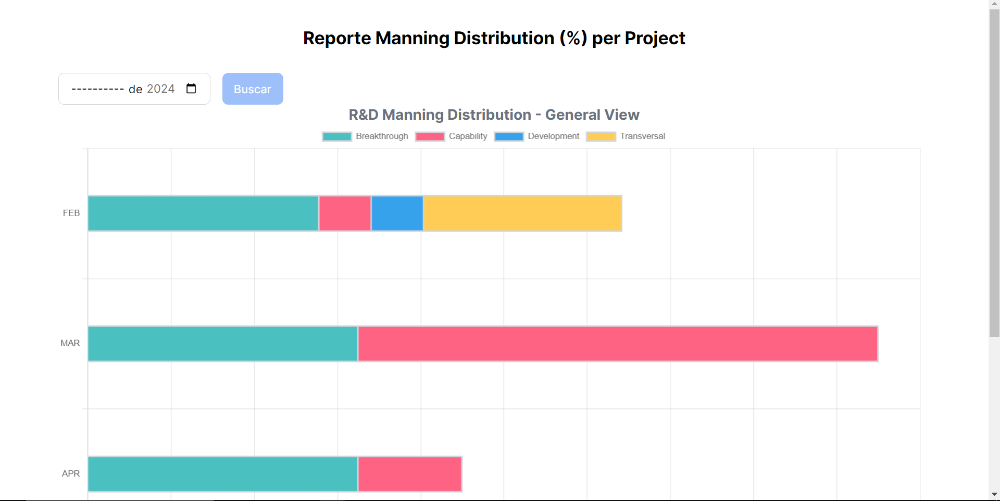
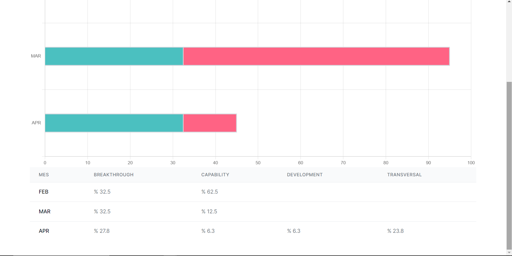

# Valtec Test

## Demo en línea

Puedes revisar la demo en línea del test completado en el siguiente enlace: [Demo del Test](https://valtec-test.vercel.app/)

## Tecnología utilizada

- **Frontend**: React.js, Typescript
- **Gráficos**: Chart.js

Espero que el resultado esté a la altura de sus expectativas. Si necesitan más información o tienen alguna pregunta, no duden en contactarme.

## Capturas de pantalla

  

